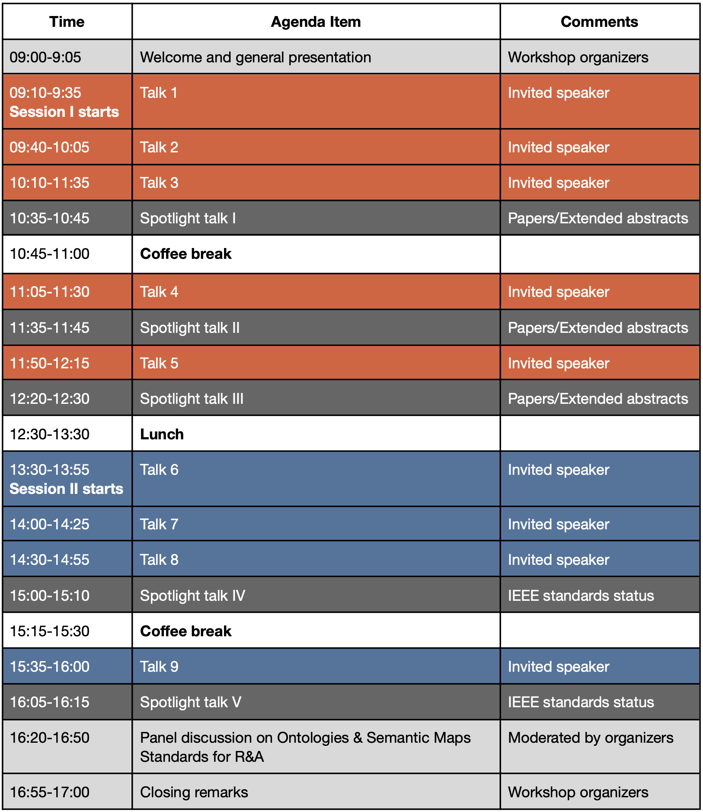

**Location:** Campus of Eindhoven University of Technology ***(Atlas building, Room 2.215)***, Eindhoven, the Netherlands

**Invited speakers for Session I**

- **[Talk 1] Ho Seok Ahn** (The University of Auckland, New Zealand)
*Orchard harvest robot system - Real-world application*

- **[Talk 2] Alessandro Umbrico** (Institute of Cognitive Sciences and Technologies (CNR), Italy)
*Context-Aware Planning: Bridging Ontological Knowledge and Autonomous Actions*

- **[Talk 3] Jiyong Oh** (ETRI, South Korea)
*Revolutionizing Human-Robot Interaction: User-Centric Teaching Pendant for Semantic Map-based Mobile Manipulation*

- **[Talk 4] Ilaria Tiddi** (Knowledge in AI, Vrije Universiteit Amsterdam, The Netherlands)
*Enabling Embodied Hybrid Intelligence with Symbolic AI*

- **[Talk 5] Filippo Cavallo** (Università degli Studi di Firenze, Italy)
*Deploying Internet of Robotic Things in active and healthy ageing pilots.* 

**Invited speakers for Session II**

- **[Talk 6] Michaela Kümpel** (IAI, University of Bremen, Germany)
*Standardising environment data with ontologies: high pain, high gain?*

- **[Talk 7] Silvia Rossi** (Università degli Studi di Napoli Federico II, Italy)
*Personalization and Adaptation in HRI: what knowledge is required?*

- **[Talk 8] Tomasz Piotr Kucner** (Aalto University, Finland)
*Understanding the crowd, human awareness for multi-robot task allocation [Online]*

- **[Talk 9] Daeun Song** (George Mason University, USA)
*Leveraging Semantic Information for Social Robot Navigation [Online]*

**Panelists**

- **Dr. Joanna Olszewska** (University of the West of Scotland)

- **Prof. Jaeho Lee** (University of Seoul)

- **Prof. Tae-Yong Kuc** (Sung Kyun Kwan University)

- **Dr. DongKi Noh** (LG Electronics Inc)

 

**Tentative agenda**

Note that time is in the local time zone (The Netherlands). 

 

